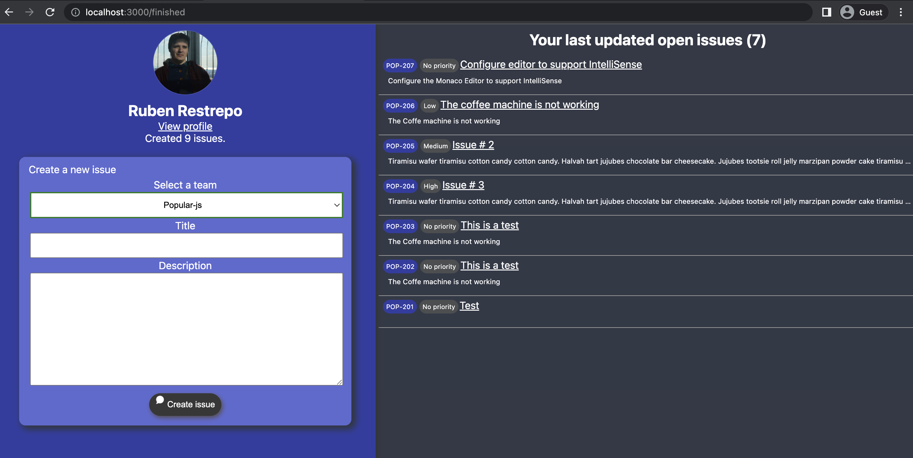

# Linear Application Example

This example assumes you already have EveryAuth configured in your development environment. If you don’t, follow the [configuration steps](https://github.com/fusebit/everyauth-express#getting-started). 

This example contains an Express.js application that integrates with the Linear API with the official Node.js [@linear/sdk](https://www.npmjs.com/package/@linear/sdk) package to display the following information:
- Linear’s user profile information
- Last 10 updated `Open` assigned issues
- A custom form for new linear issue creation


Once the application is authorized, you will see something similar like the following image:


## Install dependencies

```shell
npm i
```

Run the application

```shell
node .
```

Navigate to `http://localhost:3000`

[Read our blog post about integrating with Linear](https://fusebit.io/blog/integrate-linear-api-everyauth?utm_source=github.com&utm_medium=referral&utm_campaign=everyauth-examples&utm_content=using-linear-with-everyauth)